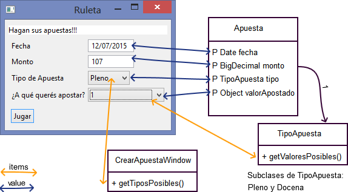
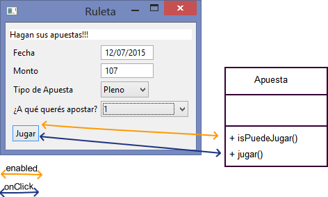

# Apuestas

[](https://travis-ci.org/uqbar-project/eg-apuestas-ui-arena-xtend)


# Enunciado

Se pide diseñar una UI para modelar una apuesta de una ruleta virtual que tenga la siguiente información:

* **Fecha** en la que se hace la apuesta
* **Monto** a apostar (un número)
* Tipo de apuesta
    - **a pleno**: se puede apostar un número de 1 al 36
    - **docena**: se apuesta primera, segunda o tercera docena.

Las reglas de validación de una apuesta son:

* se debe apostar un número positivo, pero además el monto mínimo de una apuesta a pleno son $ 10, para una apuesta a docena son $ 50
* la fecha a apostar debe ser el día de hoy o una fecha futura (válida, claro está)
* se debe indicar tipo de apuesta (en el caso del pleno, el número; en el caso de la docena, qué docena)

Una vez apostado, el jugador espera el resultado de la apuesta:

* de la ruleta sale un número del 0 al 36
* el premio por ganar una apuesta a pleno es 35 veces el valor de la apuesta, mientras que es 11 veces para una apuesta a docena
* el sistema debe informar si el apostador ganó o perdió. En el primer caso debe quedar claro el monto ganado, en el segundo el número que salió.

# La aplicación


## Binding anidado

El binding entre vista y modelo se puede explicar en estos gráficos:





Algunas decisiones de diseño que tomamos para modelar el dominio:

* necesitamos un objeto que modele una apuesta particular
    - sabe si es válida (isPuedeJugar)
    - juega, lo cual produce un resultado
* el resultado se reifica en un objeto, que a su vez se subclasifica en dos posibilidades
    - ganar (sabemos cuánto)
    - o perder
* la apuesta admite diferentes tipos de apuesta polimórficos
    - a docena
    - o pleno

El comportamiento polimórfico de los tipos de apuesta son los métodos que definen

* saber si el apostador ganó
* los valores posibles para apostar
* cuánto debe multiplicar lo que apostó en caso de ganar
* y el monto mínimo de la apuesta

Está claro que cada uno define su estrategia para cada una de estas preguntas, lo importante es que a la apuesta no le importe, en particular la UI utiliza estos objetos polimórficos:

* para construir la lista de valores posibles para el último combo|selector
* para validar el monto mínimo, fíjense que para esto se utiliza un template method:

```xtend
class TipoApuesta {
    def validarMontoMinimo(BigDecimal monto) {
            if (monto < new BigDecimal(montoMinimo)) {
                throw new UserException('''El monto minimo para una apuesta «this» es «montoMinimo»''')
            }
    }
}

def int montoMinimo()   // es abstracto y se redefine en cada subclase
```

## Contrato de nuestros objetos de negocio

Tanto la apuesta como el tipo de apuesta se definen como observables, para indicar a Arena que nos va a interesar escuchar los eventos que ocurran al cambiar las propiedades. Además anotamos las variables de instancia de la apuesta como @Accessors:

```xtend
@Observable
@Accessors 
class Apuesta {
     Date fecha
     BigDecimal monto
     TipoApuesta tipo
     Object valorApostado
     Resultado resultado
```

## Java Beans

En general, cualquier objeto que es modelo de la vista tiene un contrato particular, que consiste en: 

* **accesors** para nuestras propiedades (getters y setters). OJO que una propiedad no necesariamente es una variable del objeto. Simplemente respeta el hecho de que entiende los mensajes getSaraza y setSaraza. Algo importante que esta bueno notar es que si tiene el getter y NO el setter esa propiedad es inmutable.
* un constructor vacío 
* en algunas tecnologías requiere que también sea serializable (se puede representar en un formato binario, esto permite sacarlo de un ambiente y llevarlo a otro)

Este contrato recibe el nombre de [Java Bean](http://en.wikipedia.org/wiki/JavaBean), que no debemos confundir con la especificación EJB (que viene de la mano de las aplicaciones J2EE).

Noten que respetar el contrato de Java Bean nunca implica que tengamos objetos que solo contienen datos (y getters y setters). **Nuestros objetos pueden (y deberían) seguir teniendo comportamiento.**

# Primer acercamiento a la vista

## Ventana de edición

Aprender un framework incluye entender la jerarquía de los objetos que trae. En particular, Arena ofrece esta jerarquía para construir ventanas:

```
 Window<T>
   |- MainWindow<T>
   |- SimpleWindow<T>
      |- TransactionalWindow<T>
      |- Dialog<T>
         |- TransactionalDialog<T>
```

* **MainWindow:** sirve para aplicaciones sencillas que solamente tienen una ventana (ej: el Conversor, no nos sirve para una aplicación que tiene navegación)
* **SimpleWindow:** una ventana que define tres áreas
    - un panel de error,
    - formulario: container (composite) donde van los controles
    - una botonera de acciones
* **Dialog:** funciona como una ventana modal, esto es: es una vista que requiere que el usuario ingrese cierta información para continuar con el flujo del sistema y hasta que no complete el formulario, la aplicación no puede continuar.
* Las transaccionales son pantallas que engloban una serie de acciones en una transacción, que se completa o cancela cuando se cierra la ventana.

## Cómo definimos la ventana de apuestas

En nuestro ejemplo, la ventana de apuestas podría ser una MainWindow o bien una SimpleWindow, elegimos la segunda opción porque queremos aprovechar el template method para no tener que definir una vez más las áreas del formulario. **Nuestro objetivo pasa por diseñar evitando repetir ideas una y otra vez.** Entonces al heredar de SimpleWindow sabemos que tenemos que proveer estos métodos:
* **createFormPanel:** cuáles son los controles que participarán de la pantalla
* **addActions:** qué acciones están habilitadas para el usuario
* la ventana tiene como modelo un tipo T, en nuestro caso ese T es un objeto Apuesta, por eso definimos

```xtend
@Observable
class CrearApuesta extends SimpleWindow<Apuesta> {
```

y al construir la ventana, le estamos pasando un objeto Apuesta:

```xtend
>>ApuestasApplication
class ApuestasApplication extends Application {
      override createMainWindow() {
            new CrearApuesta(this, new Apuesta)
      }
   ...
```

## Controles

Tenemos que elegir un componente visual para mostrar / ingresar información de la vista, aquí aparecen:

* un control para ingresar una fecha ==> un TextBox
* un control para ingresar un monto a apostar ==> mmm... ¿otro TextBox?
* un control para seleccionar el tipo de apuesta ==> hay varias opciones (Radio buttons, Toggle buttons, Combo), nosotros elegimos un Selector o Combo
* un control para seleccionar el valor a aportar ==> nuevamente, la opción Selector es la elegida.
* un label para mostrar el resultado de la acción de apostar

También necesitamos generar componentes visuales para disparar ciertos eventos 

* definimos un botón para disparar la acción de apostar o jugar


## Binding

Vemos cómo es el binding entre cada control visual y su correspondiente modelo

|Vista|Modelo|
| ----- | ----- |
|textbox para ingresar una fecha|apuesta.fecha|
|textbox para ingresar un monto|apuesta.monto| 
|selector para definir tipo de apuesta|apuesta.tipo, la lista sale de la ventana (this.tiposPosibles)|
|selector para definir valor a apostar|apuesta.valorApostado, la lista de valores está asociada a apuesta.tipo.valoresPosibles|
|botón Jugar|método jugar en la ventana, que delega en la apuesta y muestra el resultado|
|label Resultado|apuesta.resultado|

# Los controllers

## Transformers

Como hemos visto, utilizamos el mismo control para ingresar una fecha y un número, y el TextBox es en realidad un control cuyo valor se asocia a un string. Entonces ¿cómo se convierte el string que ingresamos en la UI de manera de hacer apuesta.fecha = un objeto Date?

Para muchos casos Arena hace esta conversión automáticamente, a partir de los tipos que tienen UI vs. dominio. No sucede esto para el caso de los BigDecimal, entonces debemos definir nosotros una estrategia para establecer una relación bidireccional:

* del modelo a la vista: BigDecimal a String
* de la vista al modelo: String a BigDecimal

La interfaz para describir esta responsabilidad es un objeto **Transformer**. En nuestro ejemplo generamos un objeto BigDecimalTransformer para resolver un binding que sería de otra manera incompatible. Definimos:

* **getModelType:** definimos el tipo del dominio
* **getModelView:** el tipo de la vista
* **modelToView:** cómo se transforma un objeto de dominio en un objeto de la vista
* **viewToModel:** viceversa

Para más información pueden ver [Transformer](http://arena.uqbar-project.org/uqbar-scala-parent/arena/transformations.html) la documentación oficial de Arena.

¿Qué pasa si el usuario ingresa un valor que no puede convertirse a número (o fecha)? El binding no puede establecerse, lo más natural es que eso termine en una excepción como vemos a continuación:

```xtend
>>BigDecimalTransformer
override viewToModel(String valueFromView) {
     if (valueFromView.equals(""))
           null
     else
           try
                 new BigDecimal(valueFromView)
           catch (NumberFormatException e)
                 throw new UserException("El valor ingresado debe ser un número", e)
}
```

El UserException modela un error de usuario que Arena "entiende", donde entiende significa que lo atrapa y se visualiza en un panel. Para más referencia recomendamos leer el artículo [validaciones y manejo de error en Arena](https://sites.google.com/site/programacionui/temario/02-disenio-UI/arena-validacion-y-manejo-de-errores).

# Filters

Otra opción para evitar que el usuario ingrese un monto incorrecto es atrapar caracteres que a priori sabemos que son incorrectos. Algunos ejemplos:

* no tiene sentido tipear un caracter alfabético para ingresar un monto
* o ingresar una barra como primer caracter de una fecha
* o bien una coma cuando el valor es un número entero

Entonces al textbox le podemos definir un filtro específico, que impida input incorrecto:

```xtend
>>CrearApuesta - Ventana
new TextBox(editorPanel) => [
    value <=> "fecha"
    withFilter(new DateTextFilter)
]
```

Intentamos ingresar una fecha tipeando varias veces el número 1. Nos deja ingresar "1" y luego "11", pero el tercer "1" se filtra, sólo es válido ingresar un "/" en la tercera posición del textbox.

Una desventaja de esta estrategia es que no proporciona un feedback al usuario de qué es lo que está ingresando incorrectamente, así como la ventaja es tener una validación casi inmediata del valor a ingresar.

Vemos la implementación del DateTextFilter (en el mismo proyecto):

```xtend
class DateTextFilter implements TextFilter {
      override accept(TextInputEvent event) {
            val expected = new ArrayList(#["\\d", "\\d?", "/", "\\d", "\\d?", "/", "\\d{0,4}"])
            val regex = expected.reverse.fold("")[result, element| '''(«element»«result»)?''']
            event.potentialTextResult.matches(regex)
      }
}
```

Parece que tiene una lógica compleja: ¿qué sentido tiene mostrarles este código?

* Primero que nada, probar que en muchos casos la lógica de la UI suele ser más complicada que la lógica de dominio
* No queremos escribir una y otra vez esa lógica, entonces cuando encontramos una abstracción (Filter, y en particular DateTextFilter) lo encapsulamos en un lugar y lo tratamos de reutilizar tantas veces como sea posible. Arena colabora mucho para que esto suceda, porque es el primero que reifica el concepto de filtro (además del de transformer, ya presentado).

Mostramos otro ejemplo, aplicando un filtro numérico a un textbox:

```xtend
new TextBox(form)
          .withFilter [ event | StringUtils.isNumeric(event.potentialTextResult) ]
```

# Segunda parte de la vista

## Qué necesita un Selector

Un selector o un combo no solamente tiene que bindearse contra un valor del modelo, también necesitamos decirle la lista de valores posibles.

Vemos el primer selector que define los tipos de apuesta (en la clase CrearApuestaWindow):

```xtend
new Selector(editorPanel) => [
    allowNull = false
    (items <=> "tiposPosibles").adapter = new PropertyAdapter(TipoApuesta, "nombre")
    value <=> "tipo"
]
```

El modelo del selector, es una apuesta, por eso se bindea el valor contra la propiedad tipo.
Los ítems hay que pensarlo más que otras propiedades porque por lo general el objeto de dominio no conoce los valores posibles para llenar en el combo, en el ejemplo la misma ventana que crea las apuestas genera la lista de tipos de apuesta (en la clase Apuesta):

```xtend
def getTiposPosibles() {
 #[new ApuestaPleno, new ApuestaDocena]
}
```

Otro ejemplo similar, si estoy seleccionando el color de un auto en una colección, es difícil que el auto me pueda decir todos los colores disponibles.

**Pequeña disgresión:** en UI me conviene que los ítems sean una lista, para que esté ordenada y sea cómodo de seleccionar para el usuario (si no aparecen cada vez en distinto orden y eso puede ser problemático).

## Binding contra otros modelos

En general escribir

```xtend
new Selector(editorPanel) => [
    value <=> "tipo"
]
```

equivale a hacer

```xtend
new Selector(editorPanel).bindValue(new ObservableProperty(this.modelObject, "tipo"))
```

Lo que pasa es que queremos reflejar para la mayoría de los controles que el binding default es contra el modelo de la ventana (su contenedor). Nosotros definimos el container del control al crearlo:

```xtend
val selectorApuesta = new Selector(editorPanel)
```

Si queremos utilizar otro modelo, existen otros métodos:

* bindValue
* bindEnabled
* bindVisible
* y para el selector bindItems. 

En todos los casos se espera una ObservableProperty que relaciona:

* un modelo
* y una propiedad de ese modelo 

## Combos anidados

```xtend
new Selector(editorPanel) => [
    items <=> "tipo.valoresPosibles"
```

¿Qué estamos queriendo representar aquí?
Hemos visto recién que el modelo se asume como un objeto Apuesta (el mismo modelo que la ventana donde estamos).
Entonces "tipo.valoresPosibles" como propiedad equivale a referenciar a una apuesta.tipo.valoresPosibles (hay una indirección).

Definimos 3 tipos de binding: 

* simple: "descripcion"
* anidado: "tipo.valoresPosibles"
* indexado: "tipo[2]"

¿Cuáles son los valores posibles? Sabemos que depende del tipo de apuesta, definido en métodos polimórficos:

```xtend
class ApuestaPleno extends TipoApuesta {
    override getValoresPosibles() {
            (1 .. 36).toList.asObjects
    }
}

class ApuestaDocena extends TipoApuesta {
    val docenas = #["Primera", "Segunda", "Tercera"]

    override getValoresPosibles() {
            docenas.asObjects
    }
}
```

Lo que queremos es que además, ese comportamiento sea dinámico y cambie cuando el tipo de la apuesta cambie. Bueno, gracias al binding de Arena no hay que hacer más nada:

1. Cuando el usuario cambia el selector del tipo de apuesta (supongamos a Docena)...
2. ...se hace un apuesta.setTipo(docena) ...
3. ...esto dispara notificaciones del modelo a la vista... no le interesa al selector del tipo de apuesta, porque él fue el que disparó el evento de cambio
4. pero sí le interesa al selector de valor a apostar, que recibe la notificación y cambia los ítems según lo que devuelve el objeto apuesta.tipo.valoresPosibles, donde tipo es el objeto ApuestaDocena
5. lo mismo pasa cuando cambiamos la selección a ApuestaPleno, se notifican los selectores tipo de apuesta y nuevamente, el de valores que refresca su contenido.

Dejamos al lector otras dos opciones para definir el binding de items contra un observable property:

```xtend
selectorApuesta.bindItems(new ObservableProperty(this.modelObject, "tipo.valoresPosibles"))
```

que también podría escribirse como

```xtend
selectorApuesta.bindItems(new ObservableProperty(this, "modelObject.tipo.valoresPosibles"))
```

lo que no me conviene es hacer:

```xtend
selectorApuesta.bindItems(new ObservableProperty(this.modelObject.tipo, "valoresPosibles"))
```

porque define en el momento de crear la ventana un binding contra un objeto que puede cambiar a lo largo del ciclo de vida de la ventana, no quiero bindear el combo contra un tipo de apuesta específico, cuando el usuario seleccione otro tipo de apuesta, no voy a verlo reflejado (los tipos de apuesta pleno y docena no van a cambiar, sí los ítems del combo cuando cambie el tipo de apuesta de pleno a docena).

## Seteo del width manual

El Width de arena es automático, pero en los combos que arrancan vacíos y después se llenan, conviene definirle un width manual fijo:

```xtend
new Selector(editorPanel) => [
    width = 100
]
```

# Acciones

Cada botón espera un bloque que tiene que definirse de la siguiente manera:  [ | ... acción ...]

```xtend
new Button(actionsPanel) => [
    caption = "Jugar"
    setAsDefault
    onClick [ | jugar ]
```

En el ejemplo tenemos un binding para habilitar o deshabilitar el botón

```xtend
new Button(actionsPanel) => [
    bindEnabled(new NotNullObservable("valorApostado"))
    bindEnabledToProperty("puedeJugar")
```

El botón se deshabilita cuando no tengo valor apostado (bindEnabled(new NotNullObservable("valorApostado"))

### ¿Cómo funciona el NotNullObservable?

Le pasamos una propiedad: si el valor de esa propiedad es distinto de null => lo relaciono con true => el botón debería habilitarse, 
si el valor de esa propiedad es null => lo relaciono con false => el botón debería deshabilitarse.
¿A qué controller que vimos antes se parece esto? A un Transformer claro, de un object (nulo o no nulo) a Boolean. 

# Intro a validaciones

##  Dónde y cuándo validar

Es decir, quién sabe la regla y quién ejecuta la validación.

* **Dónde:** Lo más conveniente es que el dominio trate de validar sus reglas (las apuestas a pleno tienen que ser de 10 pesos o más, no puedo apostar para fechas pasadas). 
* Pero el **cuándo** lo tiende a definir más la UI, y ese cuando tiene varios momentos:

1. cuando aprieto una tecla, se activan **filtros** en el input, es inmediato pero no devuelve feedback al usuario, no dice por qué al presionar una letra no aparece en el control. También se activan **transformers** que hacen setXXXX en los objetos de dominio: es bueno porque el usuario ve en el Error Panel cuando hace las cosas mal. Por otra parte al ingresar una fecha no me deja terminar de escribirla y ya me está diciendo que está mal...
2. onBlur / onLostFocus (Arena no lo provee pero existe en otras tecnologías): cuando dejo de estar en un campo y salgo hacia otro
3. en la acción de Aceptar: permite al usuario esperar a que cargue la información. Por ejemplo: el monto mínimo de la apuesta depende de si apuesta a pleno o a docena. Entonces si pongo la validación en el setter es un poco molesto para el que escribe esa validación y para el usuario, que está siguiendo el orden del formulario y todavía no llegó al tipo de apuesta.

En la UI es muy frecuente que en algún momento el usuario tenga un objeto que esté en un estado inconsistente.
